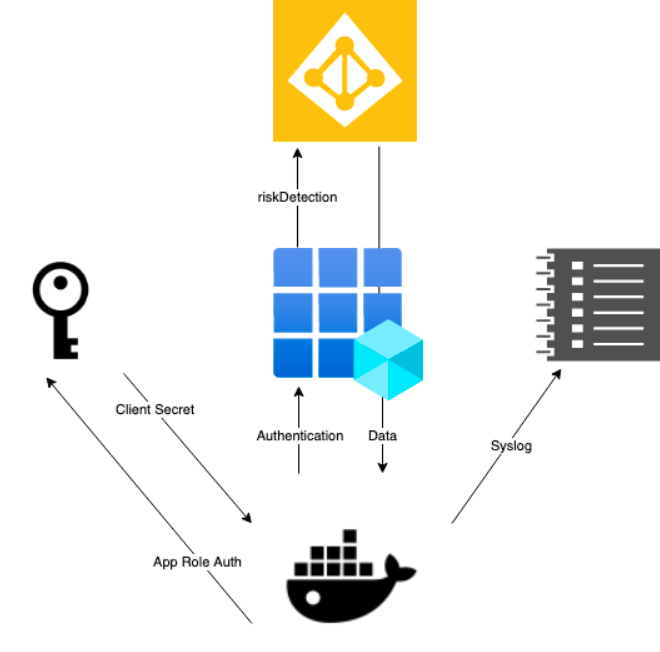
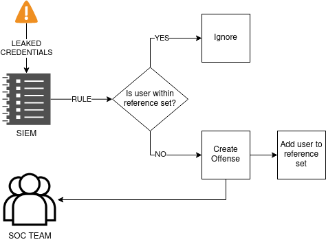

    <h1>Azure Identity Protection</h1>
    

### Workflow
Given the relevant information of Azure Identity Protection events, this automation can be used as a log stream, so that it can feed different SIEM solutions via SYSLOG. With the following events, different rules can be configured in order to enhance your security operations and posture:
* Additional Risk Detected
* Admin confirmed user compromised
* Anonymous IP address
* Atypical travel
* Azure AD Thread intelligence
* Leaked Credentials
* Malware linked IP address

[MS Docs - Identity Protection Risks](https://docs.microsoft.com/en-us/azure/active-directory/identity-protection/concept-identity-protection-risks)

### SOC - Use Case
SOC - Use case
Given the filters within our query parameters where we're collecting events from the last day, an offense rule can be created along with a reference set/whitelist (TTL of 24 hours). This configuration setting allow us to place our automation over a cron file (or over serverless) based on a particular schedule (e.g., every 15 minutes), and ensure we'll be able to handle these findings such as a **leaked-credential** alert in a timely manner. 

The following diagram described this procedure and the usage of the exception list:

    

